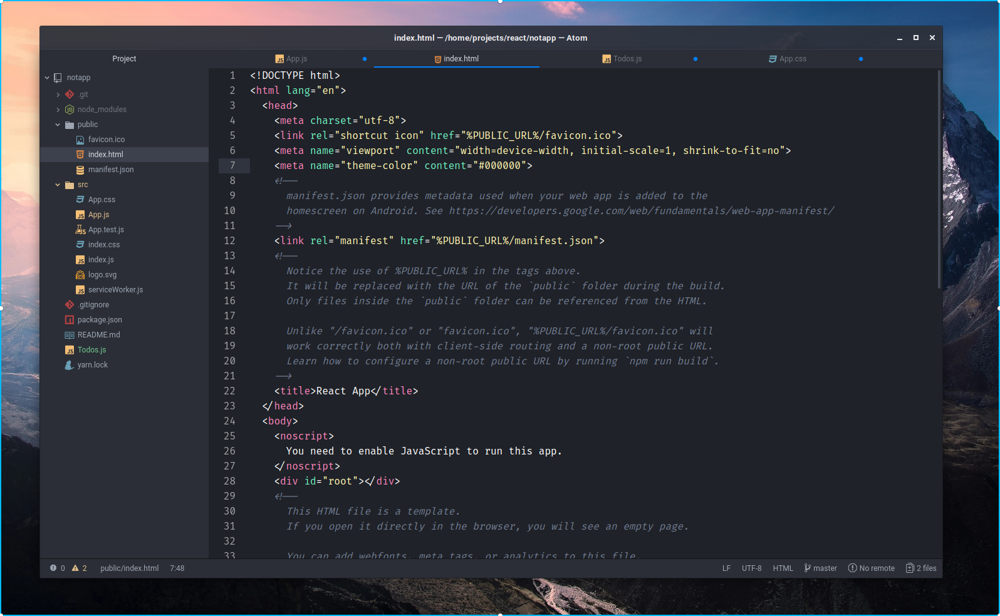

# PLANE-ATOM-UI THEME

A beautiful syntax theme for Atom, more information in [Plane project](https://github.com/wfpaisa/plane)

## Install
1. Download in `~/.atom/packages/plane-atom-ui`
2. Open: Settings -> Themes -> UI theme  and choose: Plane Atom
3. I recommending install too, install [plane-atom-syntax](https://github.com/wfpaisa/plane-atom-syntax)

## License

[MIT License](./LICENSE)
